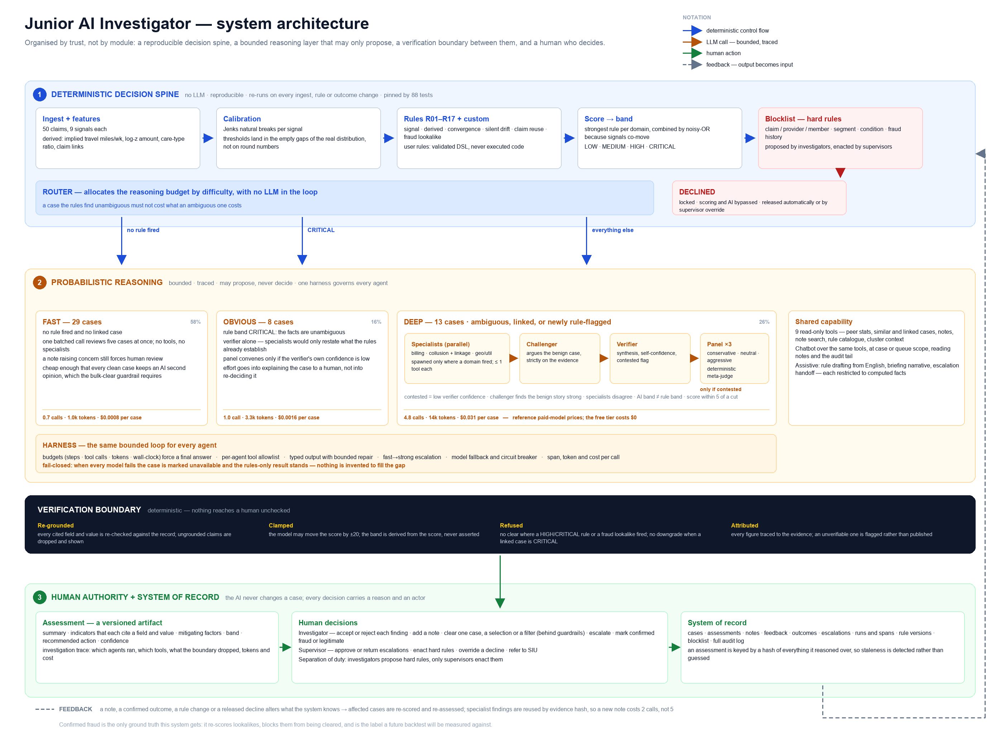

# Junior AI Investigator

**An AI-first case-review tool for fraud investigators.** An investigator opens it in the morning and the queue of referred long-term-care (LTC) insurance claims is *already triaged*: every case has a risk score from data-calibrated rules, an AI assessment with cited evidence and a recommended next step, and a queue-level briefing says where to look first. The human stays in control of every decision.

> Built as a take-home prototype for the "AI-First Case Review" brief. The 50 claims are synthetic and unlabelled; see [Limitations](#limitations-and-honest-caveats).



---

## Contents

1. [What it does](#what-it-does)
2. [Quick start](#quick-start)
3. [Configuration](#configuration)
4. [A 5-minute tour](#a-5-minute-tour)
5. [How it works](#how-it-works)
6. [What the data showed](#what-the-data-showed)
7. [API reference](#api-reference)
8. [Data model](#data-model)
9. [Project layout](#project-layout)
10. [Testing and evaluation](#testing-and-evaluation)
11. [Documentation and deliverables](#documentation-and-deliverables)
12. [Design decisions and trade-offs](#design-decisions-and-trade-offs)
13. [Limitations and honest caveats](#limitations-and-honest-caveats)
14. [Roadmap](#roadmap)
15. [Troubleshooting](#troubleshooting)

---

## What it does

| Area | What you get |
|---|---|
| **Morning briefing** | Risk counts and dollar exposure, top cases to open first, **rule clusters** (cases sharing a rule pattern), **abnormal firing** (a rule firing far more often in a care type / state / month), reused claim numbers, crew cost and routing, an optional AI narrative restricted to the computed numbers. |
| **Per-case AI assessment** | Summary, key indicators that each cite an exact field and value, mitigating factors, risk level, recommended action, next steps, open questions, calibrated confidence, and a full **investigation trace** of which agents ran and what they said. |
| **Rules engine** | 17 numbered rules (R01–R17) with LOW / MEDIUM / HIGH / CRITICAL levels. Thresholds are **computed from the data** (natural breaks), not guessed. Score = strongest rule per fraud domain combined by noisy-OR. |
| **Agent crew** | A deterministic router sends each case to a lane; only hard cases get the full crew (specialists, challenger, verifier, judge panel). Every agent runs in a bounded, traced harness. |
| **Guardrails** | The model proposes, deterministic code disposes: score moves at most ±20, the level is derived, every citation is re-verified against the record, and risky "clear" recommendations are refused. |
| **Notes the AI reads** | Manual notes feed the assessment and the chatbot, are treated as untrusted input, and can be **deleted everywhere** (assessments, chat, related-case context and audit text are purged). |
| **Cross-case knowledge** | Agents see notes, decisions and confirmed outcomes from *related* cases (same claim number + nearest by signal profile) and can search every note. |
| **Chatbot** | Per-case and queue-level chat over 9 read-only tools; sees the case, the assessment, all notes and the audit tail. |
| **Bulk clear** | By filter (e.g. `score < 10`) **or by the rows you tick**, behind a guardrailed preview that lists what is blocked and why. |
| **Escalation** | To a supervisor with an AI-drafted, editable handoff; the supervisor approves (to SIU) or returns with a note that flows back into the AI's context. |
| **Rules tab** | Create, tune, shadow-test and delete rules in the dashboard (no code deploy), applied to **every case immediately**, with an impact preview, versioning, audit, and **precision/recall backtests**. |
| **Blocklist** | Hard rules that **auto-decline** a case (claim numbers, provider/member IDs, segments, hard conditions, fraud-history rules). Investigators propose, supervisors activate, and a supervisor can override a decline with a written reason. |
| **Outcome feedback** | Mark a case (even one already cleared) as confirmed **FRAUD** or **LEGITIMATE**. Lookalikes fire rule R17, are re-scored, and can no longer be cleared quietly. |
| **Audit log** | Every AI action and human decision, with who, what and when; CSV export. |

---

## Quick start

**Requirements:** Python 3.10 or newer (developed on 3.14). No Node, no build step, no database server.

```bash
git clone https://github.com/siddheshpradhan39/Case-Review-for-Fraud-Investigators.git
cd Case-Review-for-Fraud-Investigators

python3 -m venv .venv
.venv/bin/pip install -r requirements.txt

cp .env.example .env            # then put your OpenRouter key in .env
.venv/bin/python -m uvicorn app.main:app --port 8000
```

Open **http://localhost:8000**.

**What happens on first start**

1. The app ingests `data/sample_cases.csv`, computes derived features, calibrates thresholds, evaluates all rules and scores every case. The **rules-only queue is usable immediately**.
2. If an API key is configured, AI triage starts in the background, highest-risk cases first. Progress shows in the top-right pill. On free models a full pass takes roughly 10 minutes; results are cached and only stale or missing cases are re-run afterwards.
3. Without a key the app still runs fully in rules-only mode; AI columns stay empty and nothing is invented.

**Personas.** Use the switch in the top right to act as *Alex Rivera (Investigator)* or *Sam Okafor (Supervisor)*. There is deliberately **no authentication** (out of scope for the brief). The persona resets to Investigator on every page reload; supervisor-only actions (approve escalations, activate blocklist entries, override declines) need the Supervisor persona.

**Get a key.** A free key from [openrouter.ai](https://openrouter.ai) is enough. Never commit it: `.env` is git-ignored.

**Windows.** Activate the virtualenv (`.venv\Scripts\activate`) and run `python -m uvicorn app.main:app --port 8000`.

---

## Configuration

Everything is configured through `.env` (see [`.env.example`](.env.example)).

| Variable | Default | Meaning |
|---|---|---|
| `OPENROUTER_API_KEY` | – | OpenRouter key. Without it the app runs rules-only. |
| `OPENROUTER_MODELS` | 4 free tool-calling models | Comma-separated fallback chain, tried in order (429/503 are routine on the free tier). |
| `OPENROUTER_MODELS_FAST` / `_STRONG` | falls back to `OPENROUTER_MODELS` | Optional per-tier chains. The fast tier serves specialists, challenger, panel and the FAST lane; the strong tier serves the DEEP-lane verifier. **Out of the box both tiers use the same free models**, so "strong" is strong in name only until you set a better model here. |
| `OPENROUTER_REASONING` | `off` | Reasoning models otherwise burned the token budget and returned empty replies (measured 65–130 s vs ~20 s). |
| `AGENT_MODE` | `crew` | `crew` (adaptive agent crew) or `single` (the original one-judge tool loop, kept as the A/B baseline). |
| `LLM_MODE` | `live` | `live`, `record` (live + save to `data/cassette.json`), or `replay` (offline, deterministic evals). |
| `LLM_RPM` | `18` | Client-side request cap for free-tier limits. |
| `PRICE_FAST` / `PRICE_STRONG` | `0.25,1.25` / `3,15` | Reference $ per 1M tokens (in,out), used **only** to report what a call pattern would cost on paid models. The free tier itself costs $0. |

---

## A 5-minute tour

1. **Morning briefing** (landing page): risk counts, top cases, rule clusters. The Home Health Aide segment over-fires visit-frequency and peer-amount rules.
2. **Open C1001** from the Queue. It looks clean on its own signals, but shares a claim number with the critical C1031. Its **Investigation trace** shows the collusion specialist, the challenger, a judge panel, and the *linked-case floor* refusing a downgrade.
3. **Open C1011** (ambiguous, HIGH). Add a note such as *"member relocated to Tampa in March, so the distance is explained"*. The assessment turns **stale**; click *Re-assess* and watch the score move within its guardrails. Ask the chatbot *"what did the investigator note?"*. Then **delete the note** and confirm it is gone everywhere.
4. **Queue → preset "score < 10" → Bulk clear.** Try widening the filter: HIGH/CRITICAL cases are blocked with reasons. Or tick two rows and use **Clear selected**.
5. **Rules tab.** See precision/recall for all 17 rules, build a new rule, watch the live backtest and *impact if saved*, save it as **shadow**, then promote it.
6. **Blocklist tab** (as Supervisor). Create a claim-number entry, watch the case become **DECLINED** and locked, then override it with a reason.
7. **Case page → "Mark as FRAUD"** on a cleared case: lookalikes fire R17 and are flagged. Retract to undo.
8. **Audit log** shows every step above.

---

## How it works

```
CSV → derived features → calibration → rules R01–R17 (+ custom) → domain-capped score
                                                    │
                    blocklist (hard rules) ──► DECLINED (locked, AI skipped)
                                                    │
                                   Router (deterministic, no LLM)
              ┌───────────────────────┼─────────────────────────────┐
        FAST (no rule fired)   OBVIOUS (CRITICAL)             DEEP (everything else)
        1 batched cheap call   verifier only        specialists ∥ → challenger → verifier
                                                        → judge panel only if contested
                                                    │
                          guardrails (deterministic) → assessment + trace + cost → human decides
```

The full diagram — including the harness, the verification boundary and the feedback loops — is [`docs/architecture.png`](docs/architecture.png) ([SVG](docs/architecture.svg)).

### 1. Derived features (`app/features.py`)
Each feature exists because analysis showed it separates cohorts: implied weekly travel miles (visits × distance × 2), log-scale robust z of the amount, amount relative to the care-type median, binary-flag count, and linked cases (same claim number). Days since a policy change is *not* invented: the data only has a 0/1 flag.

### 2. Calibrated rules (`app/rules.py`, `app/calibration.py`)
For each continuous signal the sorted values are split into three groups (baseline / elevated / extreme) by minimising within-group variance (Jenks natural breaks). Thresholds are the midpoints of the empty gaps, and the evidence is regenerated into [`docs/RULES.md`](docs/RULES.md).

| Rule | What it detects | Level |
|---|---|---|
| R01 | Duplicate service billed | HIGH |
| R02 | Service overlaps another provider | HIGH |
| R03 | Shared contact info with provider | HIGH |
| R04 | Recent policy change (weak alone: fires on 12/50) | LOW |
| R05 | Weekly visit frequency | MEDIUM ≥ 5.5, HIGH ≥ 10 |
| R06 | Member–provider distance (miles) | MEDIUM ≥ 47, HIGH ≥ 160 |
| R07 | Amount vs peer average (%) | MEDIUM ≥ 16, HIGH ≥ 76 |
| R08 | Round-dollar billing ratio | MEDIUM ≥ 0.29, HIGH ≥ 0.62 |
| R09 | Weekend billing ratio | MEDIUM ≥ 0.17, HIGH ≥ 0.42 |
| R10 | Prior claims (12 months) | MEDIUM ≥ 3, HIGH ≥ 7 |
| R11 | Implied weekly travel miles (derived) | HIGH ≥ 1,800, CRITICAL ≥ 4,510 |
| R12 | High-value claim (robust z of log amount) | MEDIUM; HIGH at the p90 amount |
| R13 | **Multi-domain convergence** (signals co-move, so agreement across independent domains is the real evidence) | ≥ 3 domains HIGH, ≥ 4 CRITICAL |
| R14 | **Silent drift**: no binary flag but ≥ 3 elevated signals | MEDIUM |
| R15 | Claim number reused across cases | HIGH |
| R16 | High-value claim after a policy change | MEDIUM |
| R17 | **Lookalike of a human-confirmed fraud** (human feedback) | MEDIUM (1) / HIGH (2+) |

### 3. Scoring (`app/scoring.py`)
Because the signals co-move, plain addition would double-count. The score takes the **strongest rule per domain** (Billing, Utilization, Geography, Relationship, Timing, Convergence, Integrity, Precedent) and combines domains with noisy-OR (`1 − Π(1 − w)`, weights LOW 5 / MEDIUM 12 / HIGH 25 / CRITICAL 40), plus a 0–10 baseline-anomaly term so clean cases keep a stable order. Bands: **LOW < 25, MEDIUM 25–49, HIGH 50–79, CRITICAL ≥ 80**. Each cut falls inside an empty stretch of the scored portfolio.

### 4. Router and agent crew (`app/agents/`)
The router uses only the fired rules and score band, no LLM:

| Lane | Cases | Agents |
|---|---|---|
| **FAST** | no rule fired and no linked case (29) | one batched cheap call reviews 5 cases at once, no tools |
| **OBVIOUS** | rule level CRITICAL (8) | verifier only |
| **DEEP** | everything else (13) | **specialists in parallel, only where their domain fired** (billing, collusion + linkage, geography/utilization; ≤ 1 tool each) → **challenger** (argues the benign case) → **verifier** (synthesis, self-confidence, "contested?") → a **3-persona judge panel** with a deterministic meta-judge only if contested |

A case is *contested* if verifier confidence is low, the challenger rates the benign story "high", specialists disagree, the AI band differs from the rule band, or the rule score is within 5 of a band cut.

**Harness** (`app/agents/runtime.py`): per-agent budgets for steps / tool calls / tokens / time that force a final answer; tool allowlists; no-progress detection; typed (pydantic) outputs with a bounded repair loop; fast → strong tier escalation; model fallback chain and circuit breaker; every LLM and tool call recorded as a span with tokens, latency and reference cost. Specialists see only their evidence slice (hashed), so a new note re-runs the challenger and verifier but reuses specialist findings (measured: 5 calls → 2).

### 5. Guardrails (`app/llm/guardrails.py`)
- The score adjustment is clamped to **±20** and the level is **derived** from the final score.
- Every key indicator must cite a real field whose value matches the record (or quote an actual note); ungrounded citations are dropped and *shown* to the investigator.
- `CLEAR_FALSE_POSITIVE` is refused when any HIGH/CRITICAL rule or R17 fired.
- **Linked-case floor:** a case sharing a claim number with a CRITICAL case cannot be downgraded.
- Figures in narratives are checked against the evidence; invalid or failed output is repaired, then the model chain falls back, and finally the assessment is stored as `LLM_UNAVAILABLE`. **Nothing is invented to fill a gap.**

### 6. Notes, cross-case knowledge and outcomes
- Assessments are cached by a hash of everything they reasoned over (rules, score, notes, feedback, related-case notes and outcomes). Change any of it and the assessment goes **stale** and is re-run.
- Deleting a note purges it from assessments and chat that could have seen it (its own case, plus any case that had it as related context), redacts audit text, and drops cached briefings. The deletion itself stays audited without the text.
- **Mark as FRAUD / LEGITIMATE** stores a labelled outcome with a snapshot of what the system had said (marked as a **miss** if the case had been cleared or rated low). Lookalikes within the median nearest-neighbour distance fire R17.

### 7. Rules tab and backtests (`app/rulestore.py`, `app/backtest.py`, `app/customrules.py`)
- Custom rules are a **validated declarative condition tree** (AND/OR groups over real fields), never code, so nothing from the UI is executed. Built-in rules can be enabled/disabled, have thresholds and levels tuned, and be reset to the calibrated default.
- *Test draft → live backtest and impact preview → save*, or save as **shadow** (backtested but not scoring). An optional **Draft with AI** helper turns English into a validated rule and never saves it automatically.
- **Backtests need labels and there are none yet**, so labels are selectable and explicit: **leave-one-out** (default: the case's risk level recomputed *without* the rule, so a rule never grades itself), AI-judged level, real confirmed outcomes, or a blend where real outcomes win. Results carry n and Wilson 95% intervals. Synthetic labels measure *agreement with the system*, not fraud, and the UI says so.

### 8. Blocklist (`app/blocklist.py`)
Entry kinds: claim-number, provider-ID and member-ID lists (matched whenever the data has those columns; the sample CSV has none), state / care-type segments, hard conditions (same builder as the Rules tab), and **fraud-history rules** over confirmed outcomes (N frauds on the same claim number / provider / member, N frauds or a fraud *rate* over ≥ min labelled cases in a segment). A hit sets status `DECLINED`: the case is locked, scoring and AI are bypassed, and it is excluded from the working queue and from bulk actions. Entries apply immediately and **release automatically** if they stop matching; already-closed cases raise an alert instead of being reopened.

**Governance:** investigators can only *propose* (saved paused); a supervisor activates, edits, deletes and overrides; an entry that would decline more than 25% of the queue needs explicit confirmation; overrides need a written reason and count as a false-positive signal on the entry.

### 9. Bulk clear and escalation (`app/service.py`)
A case is **blocked from bulk clear** if a HIGH/CRITICAL rule fired, R17 fired, the AI rates it MEDIUM or higher or recommends follow-up, the AI review is stale, there is no AI opinion (unless you opt in), or it is already closed or declined. Every clear needs a reason and is audited per case.

---

## What the data showed

The 50 synthetic cases fall into three tiers, which shaped the whole design:

- **8 "everything extreme" cases** (all four flags, 12–18 visits/week, 75–247 miles, +57% to +175% vs peers, $24k–$67k).
- **~9 ambiguous cases** with 1–3 flags and moderately elevated signals: where the AI judge and humans add the most.
- **33 clean cases**, plus **3 "silent" cases** (C1026, C1040, C1042) with no flag but five elevated signals, which a flag-count model would call clean.
- **Claim number `LTC-2034786`** appears on both C1001 (clean-looking) and C1031 (critical): a cross-case fact no per-row rule can see.

---

## API reference

All endpoints are under `/api`. Identity comes from `X-Actor` and `X-Role` (`investigator` | `supervisor`) headers set by the UI. Interactive docs: **http://localhost:8000/docs**.

| Group | Endpoints |
|---|---|
| **Cases** | `POST /cases/search` · `GET /cases/{id}` · `POST /cases/{id}/status` · `POST /cases/{id}/assess` · `GET /cases/{id}/runs` (trace + cost) · `POST /assess-all` |
| **Notes and feedback** | `POST /cases/{id}/notes` · `DELETE /cases/{id}/notes/{note_id}` · `POST /cases/{id}/feedback` (accept/reject an indicator) |
| **Outcomes** | `POST` / `DELETE /cases/{id}/outcome` (mark or retract fraud/legitimate) |
| **Chat** | `GET`/`POST /cases/{id}/chat` · `GET`/`POST /queue/chat` |
| **Bulk** | `POST /bulk/preview` (filter or `case_ids`) · `POST /bulk/clear` · `POST /bulk/escalate` |
| **Escalation** | `POST /cases/{id}/escalate` · `POST /cases/{id}/escalate/draft` · `GET /escalations` · `POST /escalations/{id}/decide` |
| **Rules** | `GET`/`POST /rules` · `PUT`/`DELETE /rules/{id}` · `POST /rules/{id}/reset` · `POST /rules/backtest` · `GET /rules/leaderboard` · `GET /rules/fields` · `GET /rules/{id}/history` · `POST /rules/draft` |
| **Blocklist** | `GET`/`POST /blocklist` · `PUT`/`DELETE /blocklist/{id}` · `POST /blocklist/preview` · `GET /blocklist/{id}/history` · `GET /declined` · `POST /cases/{id}/decline/override` |
| **Analytics** | `GET /briefing` · `POST /briefing/narrative` · `GET /clusters` · `GET /runs/summary` · `GET /meta` |
| **Audit** | `GET /audit` · `GET /audit.csv` |

---

## Data model

SQLite (`data/cases.db`, created on first start and git-ignored). Tables:

`cases` (features, fired rules, score, status) · `assessments` (versioned, input hash, trace) · `notes` · `feedback` · `chat` · `audit` · `escalations` · `outcomes` (with a snapshot of what the system had said) · `runs` + `spans` (agent trace, tokens, cost) · `custom_rules` + `rule_overrides` + `rule_versions` · `blocklist` + `declines` + `blocklist_events` · `kv` (briefing cache).

Case statuses: `NEW → IN_REVIEW → CLEARED | CONFIRMED | ESCALATED → SIU_REFERRED`, plus `FRAUD_CONFIRMED` (outcome) and `DECLINED` (blocklist). Deleting `data/cases.db` resets everything; the next start rebuilds it from the CSV.

---

## Project layout

```
app/
  main.py               FastAPI app + static UI (no-cache, versioned assets)
  service.py            ingest/re-score, filters, notes (+purge), dispositions, bulk clear, escalation, outcomes, blocklist enforcement
  features.py           derived features            calibration.py   natural-break thresholds → data/calibration.json
  rules.py              R01–R17 + config overrides  scoring.py       domain-capped noisy-OR score and bands
  customrules.py        rule DSL + RuleConfig       rulestore.py     custom rules, overrides, versions, audit
  backtest.py           precision/recall, labels    blocklist.py     hard rules → decline, governance
  related.py            cross-case knowledge        clusters.py      co-firing clusters, abnormal firing
  briefing.py           morning briefing            report.py        regenerates docs/RULES.md
  db.py                 SQLite schema
  agents/               runtime (harness), router, crew, domains (specialist slices), roles (prompts), schemas, evidence
  llm/                  client (tiers, limiter, breaker, replay), judge (single-judge baseline + batch triage),
                        guardrails, tools (9 read-only), chat, rule_draft
  evals/                invariants, metrics, perturb (counterfactual/injection), run (→ docs/EVAL.md)
web/                    index.html, app.js, styles.css (vanilla JS single-page app)
data/                   sample_cases.csv, calibration.json, eval_cache.json (results); cases.db is created at runtime
tests/                  88 tests (rules/scoring, guardrails, harness, router, notes/outcomes, rules tab, blocklist, bulk select)
docs/                   WRITEUP.md, Writeup.pptx, RULES.md, EVAL.md, architecture diagrams and the scripts that build them
```

About 4,600 lines of Python and 640 lines of JavaScript, no agent framework and no frontend build.

---

## Testing and evaluation

```bash
.venv/bin/python -m pytest -q tests          # 88 tests, offline (LLM stubbed), ~25 s
```

The tests cover rule thresholds against known cases, scoring bands and domain capping, guardrails (grounding, clamps, refusals, linked floor), the agent harness with a scripted fake LLM (budgets, allowlists, no-progress, repair, escalation, breaker, replay), the deterministic router, note deletion and purge, outcomes and R17, the Rules tab (DSL, tuning, shadow mode, backtest maths, leave-one-out), the blocklist (every kind, release, override, governance) and selection-based clear.

**Behavioural evaluation** (there are no fraud labels, so nothing here claims accuracy):

```bash
.venv/bin/python -m app.evals.run                       # invariants + quality/cost/agreement metrics
.venv/bin/python -m app.evals.run --perturb --shadow    # + counterfactual/injection tests + A/B vs the single judge (live LLM)
```

Latest results are in [`docs/EVAL.md`](docs/EVAL.md): 10/10 behavioural invariants (e.g. the 8 all-signal cases are never cleared), 5/5 counterfactual and prompt-injection tests, and against the single-judge baseline **100% band agreement, 27% fewer tokens** (238k vs 328k). The crew is *not* cheaper in reference dollars ($0.44 vs $0.12) because of the strong-tier verifier.

---

## Documentation and deliverables

| File | Purpose |
|---|---|
| [`docs/Writeup.pptx`](docs/Writeup.pptx) | The 3-slide write-up (product, architecture, human-in-the-loop and trade-offs) with speaker notes. Rebuild: `python docs/make_slides.py` |
| [`docs/WRITEUP.md`](docs/WRITEUP.md) | The same content in prose, with more detail |
| [`docs/RULES.md`](docs/RULES.md) | Data evidence for every threshold (regenerate: `python -m app.report`) |
| [`docs/EVAL.md`](docs/EVAL.md) | Evaluation report (regenerate: `python -m app.evals.run`) |
| [`docs/architecture.png`](docs/architecture.png) / [`.svg`](docs/architecture.svg) | System architecture, organised by trust zone. Rebuild: `python docs/make_architecture.py && python docs/svg_to_png.py docs/architecture.svg docs/architecture.png 1.5` |

The slide and diagram scripts use Pillow and `python-pptx` (already in `requirements.txt`) and macOS system fonts.

---

## Design decisions and trade-offs

- **Rules first, agents second.** Rules are deterministic, explainable and free; the LLM is a bounded reviewer of their output, not the source of truth. With no labels I did not want an unvalidated model overriding rules grounded in the data's structure.
- **A thin custom harness, not a framework.** The loop semantics (budgets, allowlists, repair, escalation, contest logic) *are* the deliverable and are explainable line by line. LangGraph or Pydantic-AI would be reasonable production choices.
- **Depth by difficulty.** 29 cases share one cheap call, 8 get a verifier, 13 get the full crew.
- **Reasoning off for structured calls.** Measured, not assumed: reasoning models spent the whole token budget on hidden thinking and returned nothing.
- **Governance as a feature.** Hard rules and bulk actions are the sharp edges, so they have previews, reasons, confirmation thresholds, supervisor roles and audit trails.
- **Honest labels.** Backtests say when labels are synthetic; costs are labelled "reference"; outcomes are never fabricated.

## Limitations and honest caveats

- **No labels, no accuracy claim.** Thresholds and weights are fit to the structure of a 50-row synthetic sample. The clean three-tier structure is a property of synthetic data. Synthetic-label precision/recall is agreement with the system, not fraud.
- **The AI mostly confirms the rules.** Against the single-judge baseline the average score difference is about 1 point. Its value is the explanation, the recommended action, cross-case context, and the challenger/panel on contested cases.
- **Weak spots found by my own evals:** the challenger rates every deep case "medium" plausibility, and calibrated confidence barely separates contested from uncontested cases.
- **"Strong tier" is nominal on free models** (same models as the fast tier) until `OPENROUTER_MODELS_STRONG` is set.
- **False negatives are the costliest risk** and only *discovered* misses can be measured, so a miss rate would be a lower bound.
- **Free-tier reality:** rate limits, ~20 s per call, non-deterministic output. About four sequential LLM hops per deep case (~65 s) suits a morning batch, not per-click use.
- **Prototype scale:** SQLite (one writer), in-process workers, O(n) similarity search, no authentication.
- **Data gaps:** the CSV has no provider/member IDs, timestamps beyond a claim date, or free text, so entity-graph and time-pattern checks cannot fire here (the code supports IDs when present).

## Roadmap

In priority order, with the reasoning in [`docs/WRITEUP.md`](docs/WRITEUP.md):

1. **False-negative safety net:** miss-rate tracking from confirmed outcomes; a retroactive look-back that reopens cleared lookalikes when a fraud is confirmed; an independent adversarial reviewer on clean cases; audited sampling with a statistical bound on undiscovered misses.
2. **Statistical anomaly detector** (robust Mahalanobis / isolation forest). *Prototyped and deliberately deferred:* on 50 cases the set of clean cases it flags changes with the random seed, so no single flag is trustworthy yet. Revisit at a few hundred cases or once outcomes can validate it.
3. Re-fit weights and thresholds from confirmed outcomes.
4. Provider/member graph and richer data; a labelled backtest.
5. Production scale-out: Postgres, queue workers with per-tenant rate limits, a vector index, incremental clustering; four-eyes on large bulk clears; streaming UI.

---

## Troubleshooting

| Symptom | Cause and fix |
|---|---|
| A new button or tab does not appear | The browser cached old JS. Hard refresh (Cmd/Ctrl+Shift+R). The server now sends no-cache headers and versioned asset URLs, so this should only happen once. |
| "LLM not configured" in the top right | Set `OPENROUTER_API_KEY` in `.env` and restart. |
| Some cases show "unavailable" | Free models were rate-limited or overloaded on every fallback. It is stored honestly; press *Re-run AI assessment* or restart to retry. |
| Supervisor actions are refused | The persona resets to Investigator on reload. Switch to *Sam Okafor · Supervisor* (top right). |
| A change to rules or notes made cases "stale" | Expected: their inputs changed. The banner offers a one-click re-assess of just those cases. |
| Want a clean slate | Stop the server, delete `data/cases.db`, start again. |
| Run evals offline | `LLM_MODE=record` once against the live API, then `LLM_MODE=replay` (uses `data/cassette.json`, git-ignored). |

---

## License

[MIT](LICENSE)
